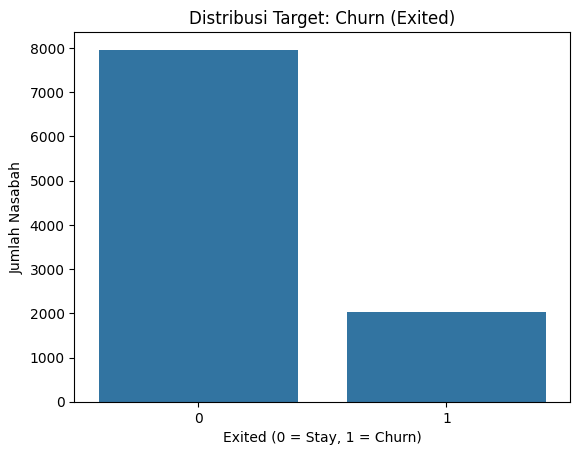
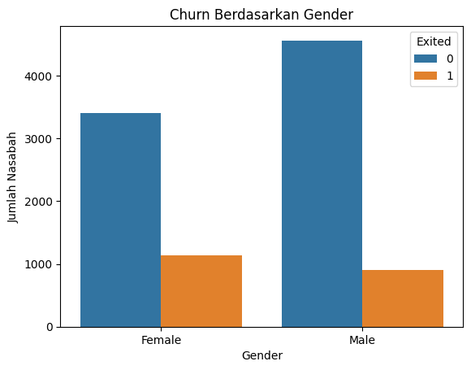
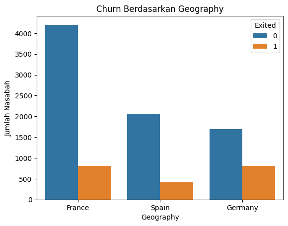
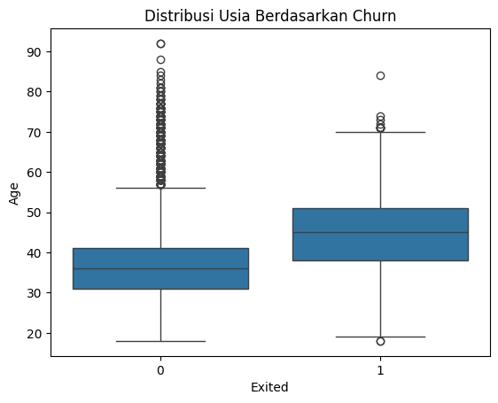
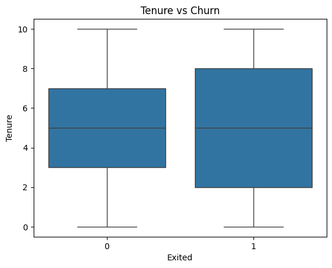
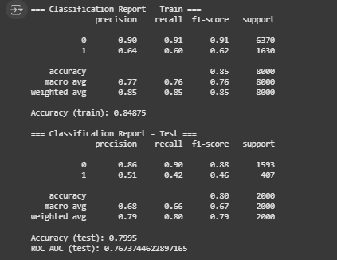
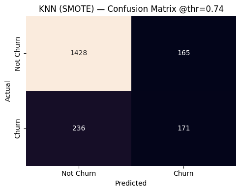
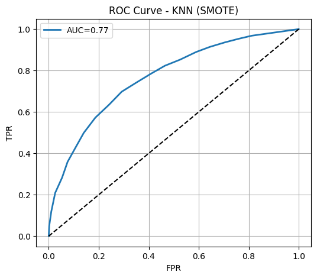
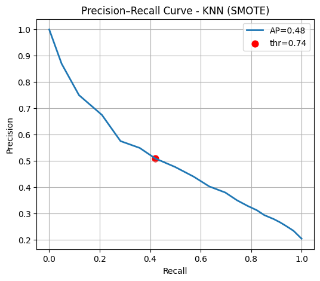

# 📉 Churn Analysis - Classification & Model Tuning

## 🎯 Objective
Membangun model klasifikasi untuk memprediksi customer churn dan memberi rekomendasi tindakan retensi. Fokus pada penanganan class imbalance, pemilihan model, serta threshold tuning agar recall pada kelas churn lebih baik tanpa mengorbankan precision secara berlebihan.
---

## 🗃️ Dataset
- Unit analisis: 1 baris = 1 pelanggan
- Target: Exited (0 = stay, 1 = churn)
- Distribusi target:
- mayoritas tidak churn (~80%) → imbalanced
  - Data quality (ringkas dari EDA):
  - Missing values: tidak ada
  - Duplicate: tidak ada
  - Outlier: tidak ada ekstrem yang mengganggu (kecuali Exited sebagai target aktual)
---
 
## 🔧 Features & Engineering
- Korelasi utama (ringkas):
  - Age (+0.29) → makin tua, risiko churn meningkat
  - IsActiveMember (−0.16) → aktif cenderung tidak churn
  - Balance (+0.12) → korelasi lemah positif
- Feature engineering (dicoba & dievaluasi VIF):
  - AgeByActivity, HasBalance, IncomePerProduct, TenureGroup
  - Fitur dengan multikolinearitas tinggi (VIF > 10) dihapus demi stabilitas model
---
 
## 🧪 Modeling Approach
- Algoritma yang dieksplorasi: Logistic Regression, KNN, Random Forest
- Class imbalance handling:
  - SMOTE di pipeline untuk KNN
  - class_weight pada Random Forest
- Hyperparameter & Threshold Tuning
  - GridSearchCV (scoring=recall) untuk memaksimalkan tangkapan churn
  - Custom threshold: memilih ambang prediksi dengan precision floor ≥ 0.50 agar tidak terlalu banyak false   positive
---

## 📈 Hasil Utama (Test Set)
- Accuracy: 0.7995
- ROC AUC: 0.7674
- Laporan klasifikasi menunjukkan peningkatan recall kelas 1 (churn) setelah threshold tuning dengan batas precision yang wajar.
---

## 💡 Insight Utama
- Segmentasi Churn
  - Pelanggan dengan usia menengah ke atas (40+) memiliki tingkat churn lebih tinggi dibanding usia muda.
  - Nasabah dengan jumlah produk hanya 1 lebih rentan churn dibanding yang memiliki lebih dari 1 produk.
  - Pelanggan dengan balance = 0 justru memiliki tingkat churn lebih rendah dibanding yang memiliki saldo sedang.
  - Nasabah dengan geografi tertentu (misalnya dari France) menunjukkan tingkat churn yang lebih tinggi dibanding negara lain.
  - Skor kredit yang rendah (CreditScore < 600) berasosiasi dengan churn yang lebih tinggi.

- Faktor Interaksi
  - Kombinasi usia tua + aktivitas rendah memperkuat risiko churn.
  - Nasabah dengan tenure singkat (0–3 tahun) memiliki churn rate lebih tinggi dibanding nasabah lama.

-Hasil Model
  - Model KNN setelah tuning memberikan keseimbangan terbaik antara recall dan precision.
  - Recall tinggi berarti model cukup baik dalam menangkap nasabah yang berpotensi churn (mengurangi loss pelanggan).
---

## 💡 Rekomendasi Bisnis
- Program Retensi Berdasarkan Usia
  - Buat program loyalitas atau penawaran khusus untuk nasabah usia 40 tahun ke atas.
  - Edukasi dan engagement khusus untuk mengurangi churn di segmen ini.

- Bundling Produk
  - Dorong nasabah dengan 1 produk untuk menambah produk lain (misalnya tabungan + kartu kredit).\\
  - Tawarkan diskon biaya administrasi atau bunga khusus untuk bundling.
  
- Geographic-Focused Campaign
  - Untuk wilayah dengan churn tinggi (contoh: France), buat campaign personalisasi, misalnya promo lokal atau kolaborasi merchant.

- Early Tenure Engagement
  - 3 bulan pertama adalah masa kritis, berikan welcome package, edukasi layanan, dan follow-up aktif dari customer service.

- Proaktif pada Risiko Tinggi
  - Gunakan skor prediksi churn model untuk menghubungi lebih dulu nasabah berisiko tinggi sebelum mereka memutuskan keluar.
---

## 📊 Visual

